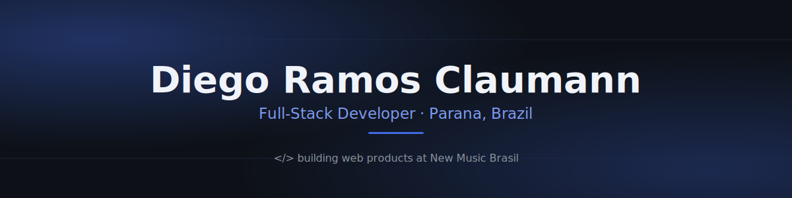

  

 

Full-stack developer building web products at <strong>New Music Brasil</strong>. I like pragmatic, well-structured code — and I'm usually the one taking things apart just to see how they work.

## 💼 Experience

**Full Stack Developer** · [New Music Brasil](https://www.linkedin.com/company/newmusicbrasil.com.br) · Full-Time
Working with `React`, `SQL`, `REST APIs`, `C#` and `.NET` to build scalable web solutions and modern user interfaces.

## 🧰 Stack

**Languages**
     

**Frameworks & Libraries**
   

**Tools**
   

## 🧭 Currently

- Sharpening my skills in **React**, **Next.js**, **Node.js**, **C#** and **SQL**
- Big fan of *The Lord of the Rings* 🧙‍♂️ and *Harry Potter* ⚡️ — and generally curious about how things work
- Open to new opportunities and collaborations — [linkedin.com/in/dclaumanndev](https://www.linkedin.com/in/dclaumanndev)

## 📊 GitHub at a glance

  
  

  

  <picture>
    <source media="(prefers-color-scheme: dark)" srcset="https://raw.githubusercontent.com/dclaumanndeveloper/dclaumanndeveloper/output/github-contribution-grid-snake-dark.svg" />
    <source media="(prefers-color-scheme: light)" srcset="https://raw.githubusercontent.com/dclaumanndeveloper/dclaumanndeveloper/output/github-contribution-grid-snake.svg" />
    
  </picture>

## 📬 Connect

 

  
    
  

