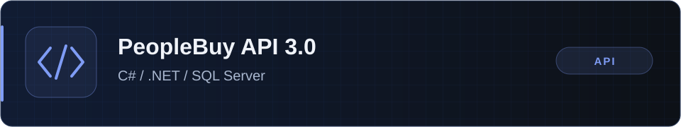
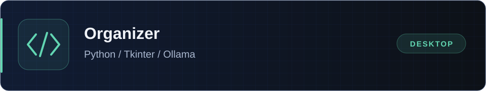
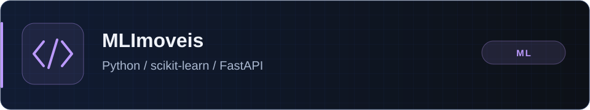

  

  <a href="README.md">English</a> · <strong>Português</strong>

Desenvolvedor Full Stack na <strong>New Music Brasil</strong>, trabalhando com React, C#/.NET e SQL. Gosto de código prático e bem estruturado — e costumo desmontar as coisas para entender como funcionam.

  <a href="https://www.linkedin.com/in/dclaumanndev">LinkedIn</a> ·
  <a href="mailto:dclaumanndeveloper@gmail.com">Email</a>

## 🚀 Projetos em destaque

### [PeopleBuy API 3.0](https://github.com/dclaumanndeveloper/PeopleBuyAPI3.0)

API REST para um marketplace, com usuários, ofertas, categorias, avaliações e busca de ofertas próximas.

- **Tecnologias:** C#, ASP.NET Core, Entity Framework Core e SQL Server.
- **Para explorar:** Autenticação JWT, documentação Swagger e geolocalização com a fórmula de Haversine.
- **Qualidade:** Testes de geolocalização, validação de CPF/CNPJ e hashing de senhas.

[Código e guia de execução](https://github.com/dclaumanndeveloper/PeopleBuyAPI3.0#readme)

### [Organizer](https://github.com/dclaumanndeveloper/Organizer)

Aplicação desktop para organizar arquivos por extensão, categoria ou sugestões opcionais de IA local.

- **Tecnologias:** Python, Tkinter e integração opcional com Ollama.
- **Para explorar:** Simulação antes de mover arquivos, desfazer, detecção de duplicados e regras personalizadas.
- **Qualidade:** Testes automatizados e CI em Linux, Windows e macOS.

[Código e guia de execução](https://github.com/dclaumanndeveloper/Organizer#readme)

### [MLImoveis](https://github.com/dclaumanndeveloper/MLImoveis)

Aplicação educacional de machine learning para estimar preços de imóveis em Maringá, Paraná.

- **Tecnologias:** Python, scikit-learn, pandas, Streamlit e FastAPI.
- **Para explorar:** Comparação de modelos com validação cruzada, interface web e API REST.
- **Qualidade:** Testes automatizados, CI e métricas de treinamento.
- **Escopo:** Usa dados sintéticos. Os resultados demonstram o pipeline de ML e não comprovam precisão sobre preços reais de mercado.

[Código, guia de execução e limitações do modelo](https://github.com/dclaumanndeveloper/MLImoveis#readme)

## 💼 Experiência

**Desenvolvedor Full Stack** · [New Music Brasil](https://www.linkedin.com/company/newmusicbrasil.com.br) · Tempo integral

Trabalho em produtos web com React, C#/.NET, SQL e APIs REST, conectando interfaces com serviços de backend e dados.

## 🧰 Tecnologias principais

<strong>Frontend</strong>

  
  
  
  
  

<strong>Backend</strong>

  
  
  
  

<strong>Dados</strong>

  

<strong>IA e automação</strong>

  
  
  
  

<strong>Ferramentas</strong>

  
  
  
  

## 🎓 Formação

**Pós-graduação em Inteligência Artificial e Machine Learning** · UniCV · Concluído em 2026

Para conhecer uma aplicação prática dos meus interesses nessa área, explore o [MLImoveis](https://github.com/dclaumanndeveloper/MLImoveis).

  

## 🧭 Atualmente

- Aprofundando meus conhecimentos em React, Next.js, Node.js, C# e SQL.
- Aberto a novas oportunidades e colaborações.
- Fã de *O Senhor dos Anéis* 🧙‍♂️ e *Harry Potter* ⚡️ — e curioso sobre como as coisas funcionam.

## 📊 Atividade no GitHub

  

  <picture>
    <source media="(prefers-color-scheme: dark)" srcset="https://raw.githubusercontent.com/dclaumanndeveloper/dclaumanndeveloper/output/github-contribution-grid-snake-dark.svg" />
    <source media="(prefers-color-scheme: light)" srcset="https://raw.githubusercontent.com/dclaumanndeveloper/dclaumanndeveloper/output/github-contribution-grid-snake.svg" />
    
  </picture>

## 📬 Contato

[LinkedIn](https://www.linkedin.com/in/dclaumanndev) · [Email](mailto:dclaumanndeveloper@gmail.com) · [GitLab](https://gitlab.com/dclaumanndev) · [Instagram](https://www.instagram.com/dclaumanndev/)

  
    
  

